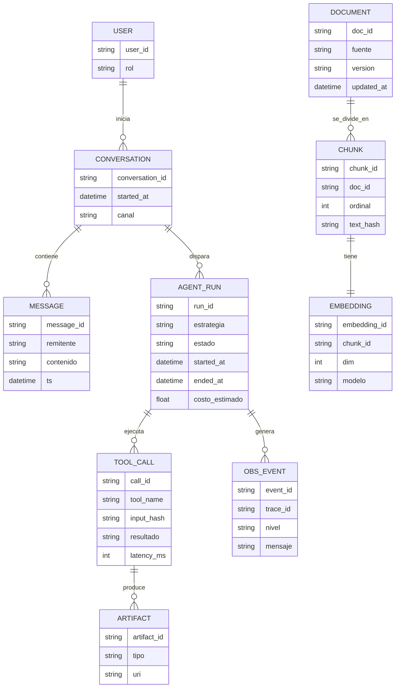

# Diagramas de arquitectura (Mermaid)

> Borrador de diagramas para documentar el modelo arquitectónico de referencia
> propuesto en la tesis. Incluye:
> - Diagrama de arquitectura de alto nivel.
> - Flujo conversacional del agente.
> - Modelo de datos mínimo.

## 1. Arquitectura de alto nivel

```mermaid
flowchart LR
  U[Usuarios\nEstudiantes / Docentes / Admin] --> CH[Canal conversacional\nWeb / Chat / Helpdesk]

  CH --> GW[Gateway / Webhook receptor]

  subgraph Orquestacion
    ORCH[Orquestador de workflows\n(p.ej. n8n, Temporal, Power Automate)]
    AG[Runtime de agente LLM\n(p.ej. OpenAI, Claude, Llama + servidor de tools)]
    ORCH -->|invoca / coordina| AG
  end

  GW --> ORCH

  subgraph Conocimiento
    SRC[Documentos institucionales\nReglamentos, FAQs, horarios] --> ING[Ingesta / Normalización]
    ING --> OBJ[Almacenamiento de objetos\n(p.ej. S3, Blob Storage)]
    ING --> META[(BD relacional / metadatos)\n(p.ej. Postgres)]
    ING --> EMB[Embeddings\n(p.ej. OpenAI, Instructor)]
    EMB --> VEC[(Vector DB\n(p.ej. pgvector, Qdrant, Chroma))]
  end

  AG -->|consultas semánticas| VEC
  AG -->|consulta metadatos| META
  AG -->|recupera documento| OBJ

  subgraph Integracion
    MQ[(Broker de mensajería / eventos)\n(p.ej. RabbitMQ, Kafka, Service Bus)]
    ORCH <--> MQ
    AG <--> MQ
  end

  subgraph Observabilidad
    OTEL[Telemetría / Trazas / Logs\n(p.ej. OpenTelemetry)] --> GRAF[Dashboards y alertas\n(p.ej. Grafana, New Relic)]
    ORCH --> OTEL
    AG --> OTEL
    MQ --> OTEL
    GW --> OTEL
  end

  AG --> CH
```

## 2. Flujo conversacional del agente orquestado

```mermaid
flowchart TD
  A[Mensaje del usuario] --> B[Clasificar intención y dominio]

  B -->|Fuera de dominio / alto riesgo| Z[Respuesta segura\n("no sé" + canal oficial)]

  B -->|Intención soportada| C[Construir plan de acción\n(RAG + tools)]

  C --> D[Recuperación: consulta a Vector DB]
  D --> E[Filtrar y seleccionar evidencia\n(según contexto y políticas)]

  E --> F{¿Se requieren herramientas externas?}
  F -->|Sí| G[Llamadas a herramientas\n(APIs, bases de datos, servicios internos)]
  F -->|No| H[Pasar directamente a composición de respuesta]

  G --> H[Componer respuesta con\nresultados de tools + evidencia]

  H --> I[Registrar ejecución\n(run, tool calls, costos, métricas)]
  I --> J[Enviar respuesta al usuario]

  J --> K[Monitoreo / alertas\n(revisiones humanas si hay fallos)]
```

## 3. Modelo de datos mínimo (conceptual)



## 4. Notas de uso en la tesis

- Estos diagramas sirven como base para:
  - El capítulo de **modelo arquitectónico de referencia**.
  - La documentación del flujo conversacional del agente.
  - La discusión sobre observabilidad y evaluación de agentes.
- En el texto LaTeX, se podrán exportar estos diagramas a imágenes o utilizar
  una herramienta que genere SVG/PNG a partir de Mermaid.
- Los nombres entre paréntesis de cada bloque indican tecnologías concretas
  candidatas para el caso de estudio, pero no son obligatorias; sirven como
  guía para el diseño e implementación. 